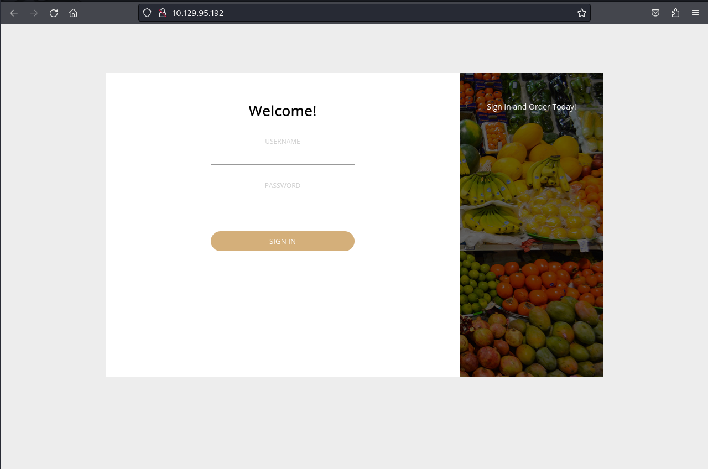

# Objectives of an External Pentest

## Checklists, FTW 

<figure><figcaption></figcaption></figure>

<figure><figcaption></figcaption></figure>

<figure><figcaption></figcaption></figure>

<figure><figcaption>
Targets
</figcaption></figure>

<figure><figcaption>
Password Spraying
</figcaption></figure>

<figure><figcaption>
Breached Accounts
</figcaption></figure>

<figure><figcaption>
Login Portals
</figcaption></figure>

<figure><figcaption>
Findings &#x26; Strengths
</figcaption></figure>

## Rules of Engagement 

<figure><figcaption></figcaption></figure>

## Verifying Scope 

<figure><figcaption></figcaption></figure>

## Client Communication 

